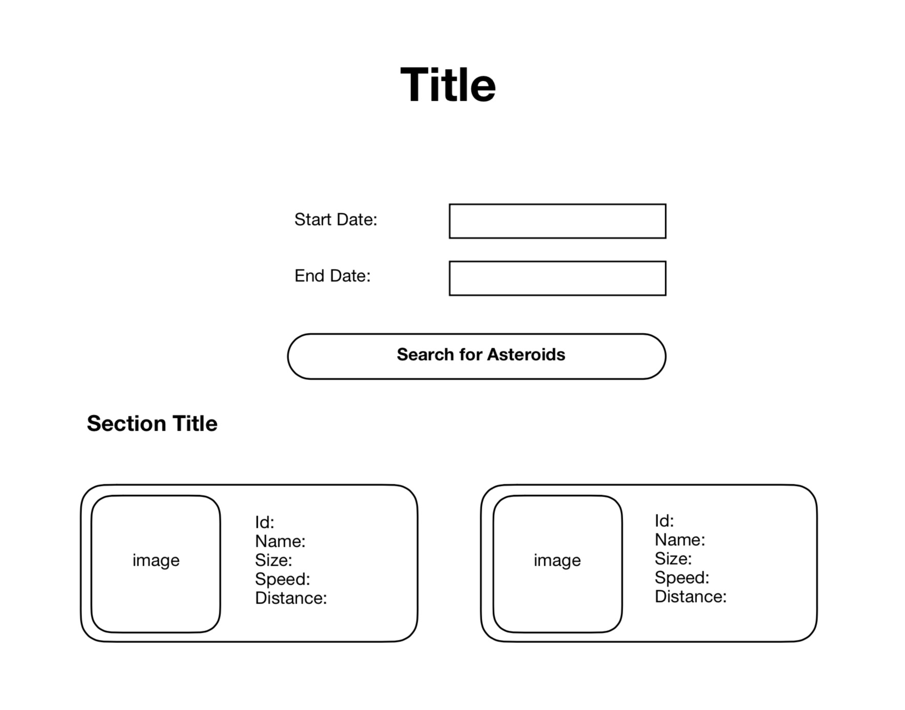

# Technical Test Using the NASA Api

Documentation URL:
https://api.nasa.gov/index.html
https://api.nasa.gov/api.html

## Setup

**Step 1**: Fork this repository on your own github profile
**Step 2**: Create API key
**Step 3**: Create a `.env` file and place your api key there. This file should not be pushed to your repository.

### Home endpoint (/):

**Input Form**

- The Input form should have 2 fields, `Start date` and `End date` as well as a button to submit the form with a value of **Search for asteroids**.

**First Api Call**  
- Use the `apod` api (`GET https://api.nasa.gov/planetary/apod`) to fetch data on the "picture of the day".
The data received should be used to set the background, title and description box.

- **Background image**: The api will provide a url. Use this url to set the background image. The background should cover the whole page and stay fixed when the user is scrolling.
***Careful! The api doesn't always returns a url to an image. Sometimes the image of the day is a video.
The response of the api contains a `media_type` key. If the value is `image`, your app should choose to use the image at the link provided by the api. If not, your app should choose to display the default image located at http://www.adwonline.ae/wp-content/uploads/2017/04/space-005.jpg***

- **Title**: The title should be the name of the image provided by the api.

- **Description Box**: When the mouse is over the title, a box should appear containing the description provided by the api.

### Map Asteroids Close To Earth

API url: `GET https://api.nasa.gov/neo/rest/v1/feed` (see documentation for query parameters)

**Requirements**

- The user can enter a start date and end date for the asteroids to be displayed.
- If the api returns an error message, an appropriate error should be displayed to the user.
- Each asteroid should be represented on the page with its relevant information
- Each asteroid is represented on the page in it's own box. (see diagram)
- The image used should be the same image for every box and is included in this repo as `astro.png`
- The background of each asteroid box should be black.
- The page should show two asteroids on each row. (see diagram)
- If an asteroid is potentially hazardous to Earth, its background should be blinking red
- For each asteroid, the following information should be displayed:
    * ID number
    * name
    * size (diameter in meters, rounded to full integer)
    * Estimated speed (in km)
    * Miss distance from Earth (in lunar units, rounded to 2 decimals)
- The page should be divided in sections. Each section represents a close approach date (see the data provided by the api). The close approach date should be seen as title to each section (see diagram)
- The asteroids belonging to each section should appear by decreasing order of size (biggest ones first).
- Write unit tests with `tape` to test the functions that you will use to sort your data.

**Recommendations**
- To understand how to use a `.env` file and create environment variables, [read this post](https://medium.com/@thejasonfile/using-dotenv-package-to-create-environment-variables-33da4ac4ea8f). The documentation for the `dotenv` module can be found [here](https://www.npmjs.com/package/dotenv)
- Start by writing your index.html page and create the form.
- Make sure you format the dates properly according to the api specifications.
- Sometimes clearing your browser cache will allow the changes to appear if you don't seem to see your latest changes on your web page.
- Before sending an api call: build your server, create a router with the endpoints you need and test it.

### Basic Design Diagram

